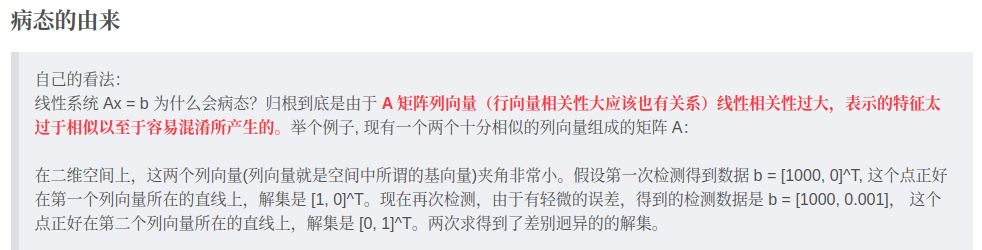

# 超定方程求解

超定方程病态的由来：

行（列）向量数量远超矩阵的秩，及行（列）向量线性相关性过大，就是两个向量夹角十分小。以二维空间为例，假设有N个行向量，那么一定存在某两个行向量的夹角小于$\frac{2\pi}{N}$，当N足够大时，较小的测量误差将使计算结果完全不同。

解决病态问题的方法就是将一些线性相关的方向去掉，对原始的病态矩阵降维，将解集限定在一组正交基空间内。

## Householder变换

## 矩阵的QR分解
