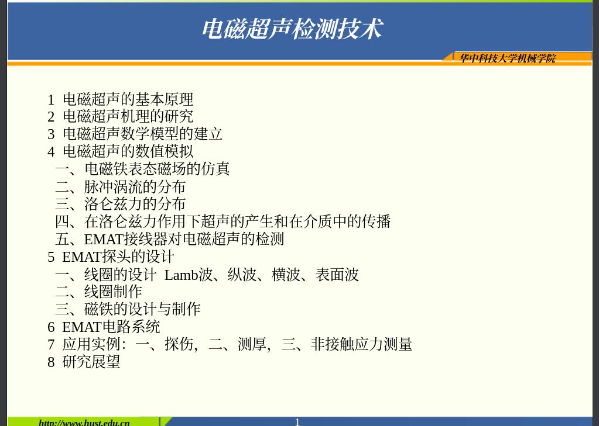

第一章 绪论

第二章 基于洛伦兹力的电磁超声检测原理

2.1 基本原理

2.2 解析模型

2.3 有限元模型

第三章 高频大功率电磁超声检测装置

3.1 系统架构

3.2 激励源

3.3 接收电路

3.4 嵌入式硬件开发

3.5 其它电路模块

第四章 电磁超声换能器的优化

4.1 永磁体

4.2 激励线圈

4.3 接收线圈

第五章 电磁超声检测技术的应用

5.1 阶梯型铝块厚度测量

5.2 兰母波测铝板缺陷

确定系统架构

核心模块：高频大功率激励模块、微弱信号调理模块、换能器模块

辅助模块：电源管理模块、嵌入式控制模块

确定各模块的关键技术指标

确定各模块的技术方案

关键技术难题与解决方法
