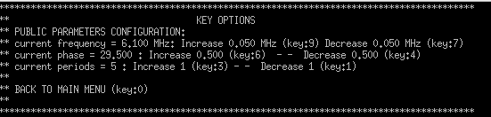

# 文献阅读

## [Performance Stability of Electromagnetic Acoustic Transducers](https://pan.baidu.com/s/17-SZgX-wREnS3NDB2vSe_A?pwd=1111)

- numeric modeling of EMAT
  - 无限远边界建模

    - perfect matching layer: 完美匹配层，只能用于时域
    - low-reflecting boundary condition:模拟边界处是两个声阻抗近似匹配的情况，反射能量较小，但不同入射角反射能量不同。
    - 阻尼：
      
  - 收敛问题
  - 提离问题
    信噪比和提离灵敏度之间的平衡问题

    - 竖直方向提离 normal lift-off

      MS-EMAT不同提离归一化幅值：0.7mm后接收幅值与提离为
      
      PPM-EMAT不同提离归一化幅值
      

      - 倾斜提离 tilted lift-off
        对接收信号的影响小

## 期刊论文 1

## 期刊论文 2

# 本周工作

DC = 20V

# 工作计划
