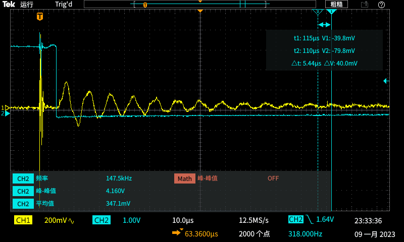
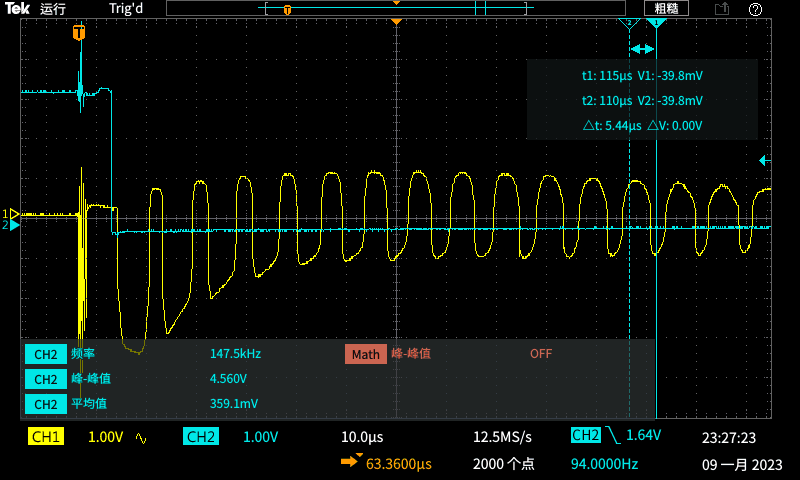

# 近期工作进展与工作计划

## EMAT文献调研

2010年至今便携式电磁超声检测仪器研究现状

基于洛伦兹力的电磁超声检测原理研究现状

## 激励模块 PA_v0.4测试

PA_v0.4  测试报告

## 激励模块PA_v0.5设计

设计目标：

功放模块最小输出阻抗由 8ohm(PA_v0.4  240V-30A) 提升至 50ohm(600V-12A)

探索宽带实现方法（低频-低DC电压，高频-高DC电压）

更新内容：

1. 增加RC吸收缓冲电路
2. 分开栅极充电和放电回路
3. 分立式隔离电路取代数字隔离器
4. 全桥输出端瞬态共模干扰抑制电路

## 接收模块LNA_v0.4测试

## 接收模块LNA_v0.5

设计目标：

解决寄生振荡带来的饱和问题

更新内容：

1. 取消钳位限幅电路，增加钳位限幅电路接口
2. 放大级前增加高通滤波接口
3. 输出增加带通滤波接口
4. 增加电源滤波

## 固定增益模块设计

## 测厚线圈设计

## 电源模块更新

## 控制程序更新

PWM时序电路更新：

1. 200kHz~10MHz	(linux程序更新)
2. 编码脉冲，调频脉冲	(FPGA程序更新)
