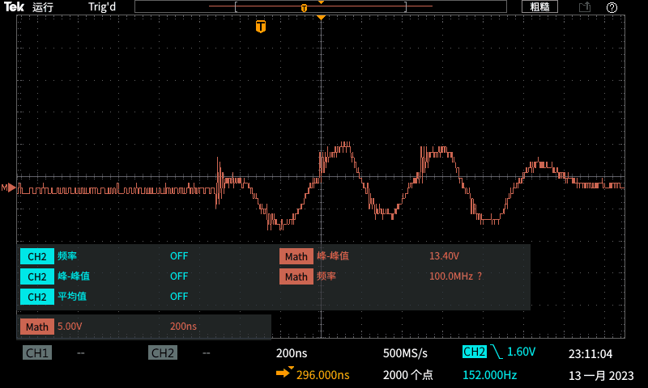

# TEST

## 2 module combiner

### condition

frequency: 2MHz

phase: 10

DC: 30V

coil impedance 3uH 18ohm ---> 41.7ohm

impedance scaling: 1:4

### result

voltage of output port ---> vpp = 472V

voltage on coil ---> vpp = 544V

current in coil (voltage on 0.5ohm sampling resistor) IPP = 26A

max periods:12

single board output voltage

DC voltage during RF pulse exciting (energy storage capacitancef: 24uF) transient power: 800W/board

## 4 module combiner

# PROBLEM

## phenomenon

high side control signal of H bridge is abnormal (narrower or disappear) when output of impedance scaling network has common ground

## analysis

**high dv/dt when mosfet switch**

